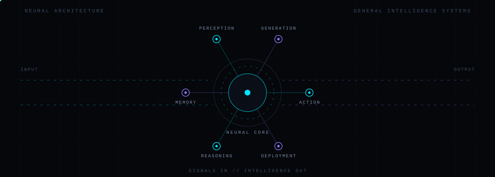

<!-- ==============================================================
     NEURAL INTERFACE v7.0 - SAAD SALMAN
     llm systems / slm optimization / local inference
     ============================================================== -->

## [ ARCHITECTURE ]

*one core - every signal - any device*

- **End-to-end by design** - raw signals in, shipped systems out, one continuous pipeline
- **General over narrow** - perception, memory, reasoning and generation composed as a single architecture
- **Boring where it matters** - dependable infrastructure underneath ambitious models
- **Instrumented always** - every system carries its own telemetry from day one

## [ OPEN SOURCE ]

*what leaves the lab*

> Good infrastructure outlives its authors. What I build gets upstreamed - in
> public, under permissive licenses, with the docs that make it reusable.
> PRs welcome.

**`UPSTREAMED:`** inference runtimes - quantization recipes - eval harnesses - agent scaffolds

<!-- contribution snake - generated by .github/workflows/snake.yml into the output branch -->
<picture>
  <source media="(prefers-color-scheme: dark)" srcset="https://raw.githubusercontent.com/SaadxSalman/saadxsalman/output/github-contribution-grid-snake-dark.svg"/>
  <source media="(prefers-color-scheme: light)" srcset="https://raw.githubusercontent.com/SaadxSalman/saadxsalman/output/github-contribution-grid-snake.svg"/>
  
</picture>

---

<!-- SIGNALS - uncomment and fill in your handles to activate

<a href="https://huggingface.co/YOUR-HANDLE">

-->

