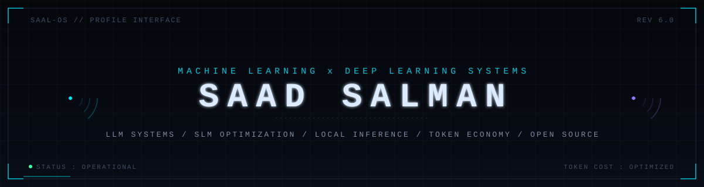
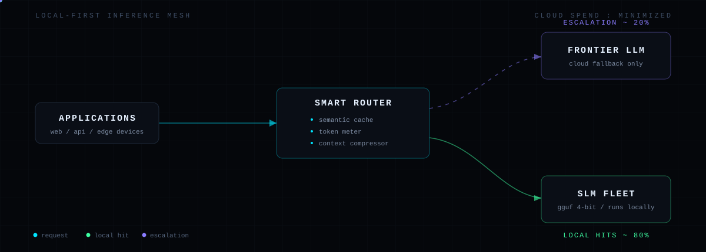

<!-- ==============================================================
     NEURAL INTERFACE v5.0 - SAAD SALMAN
     llm systems / slm optimization / local inference
     ============================================================== -->

I build **language-model systems that run where the users are** - from frontier LLMs
reasoning over private data to quantized SLMs running silently on a laptop. The design
principle never changes: **keep intelligence local, and spend cloud tokens only when
they earn their price.**

## 01 // DOMAINS

| DOMAIN | FOCUS |
| :--- | :--- |
| **LLM SYSTEMS** | Agentic pipelines / RAG at scale / fine-tuning (LoRA, QLoRA, DPO) / evaluation harnesses / open-weight deployment |
| **SLM + EDGE** | Quantization (GGUF, AWQ, GPTQ) / knowledge distillation / pruning / 1B-8B models on consumer and mobile silicon |
| **LOCAL INFERENCE** | Ollama / llama.cpp / vLLM / ONNX Runtime / TensorRT - on-prem, on-device, air-gapped |
| **TOKEN ECONOMY** | SLM-first routing with LLM escalation / semantic caching / context compression / 90%+ cost reduction |
| **PRODUCTION AI** | FastAPI services / Docker + Kubernetes / model CI/CD / observability / autoscaling inference |
| **OPEN SOURCE** | Building in public / reproducible artifacts / permissive licensing / upstream-first mindset |

## 02 // ARCHITECTURE

**The mesh in one line:** every request enters through one smart router - a local SLM
fleet answers the majority, and the frontier model is billed only as the exception.

- **Route small, escalate smart** - local SLMs absorb the bulk of traffic; the cloud LLM is a fallback, not a default
- **Quantize ruthlessly** - 4-bit checkpoints keep near-full quality at a fraction of the memory footprint
- **Cache semantically** - identical intents are answered once, then served forever
- **Meter every token** - cost becomes a first-class metric, measured on every hop

## 03 // STACK

**`NEURAL CORE`**

**`INFERENCE ENGINE ROOM`**

**`AGENT ORCHESTRATION`**

**`SHIP IT DECK`**

## 04 // TELEMETRY

## 05 // OPEN SOURCE

> Good infrastructure outlives its authors. Every inference config, quantization
> recipe and evaluation harness I build gets upstreamed - in public, under
> permissive licenses, with the docs that make it reusable.

<!-- contribution snake - generated by .github/workflows/snake.yml into the output branch -->
<picture>
  <source media="(prefers-color-scheme: dark)" srcset="https://raw.githubusercontent.com/SaadxSalman/saadxsalman/output/github-contribution-grid-snake-dark.svg"/>
  <source media="(prefers-color-scheme: light)" srcset="https://raw.githubusercontent.com/SaadxSalman/saadxsalman/output/github-contribution-grid-snake.svg"/>
  
</picture>

---

<!-- SIGNALS - uncomment and fill in your handles to activate

<a href="https://huggingface.co/YOUR-HANDLE">

-->

 

LOCAL-FIRST INTELLIGENCE - SHIPPED IN THE OPEN

